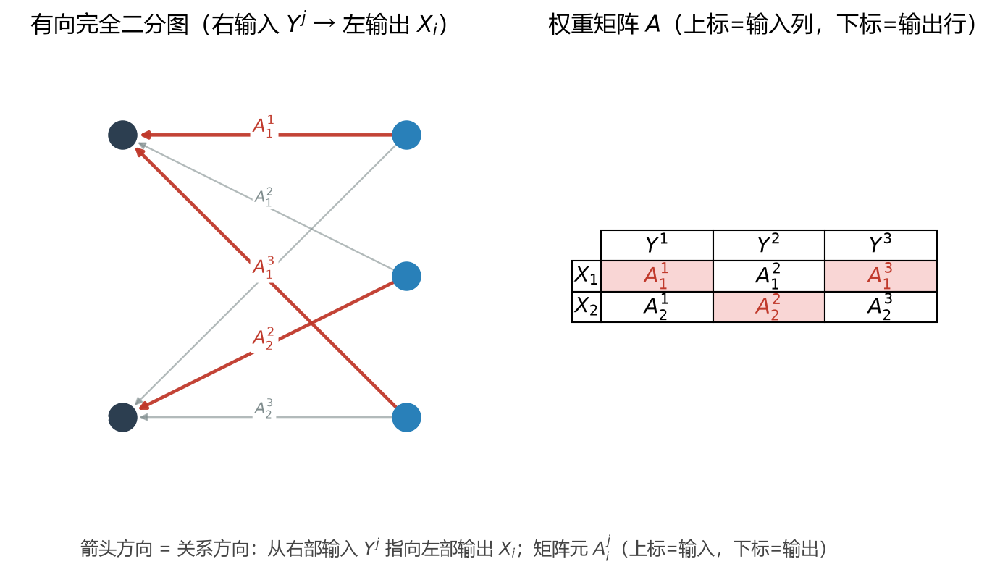

# 矩阵不是数组，而是完全二分图的权重

你学了这么多年线性代数，一直把矩阵当成一个"长方形的数表"——横着是行，竖着是列，里面塞满了数字。

但如果我们把它看成一张图，很多原本别扭的东西会突然顺理成章——尤其是那个让你每次都卡住的："矩阵乘法为什么是左行乘右列，而不是直接对应位置相乘？"

---

## 一张矩阵，就是一张完全二分图

想象两个互不相交的人群：左边站着 $m$ 个人，右边站着 $n$ 个人。规定左边每个人和右边每个人都认识，但左边内部、右边内部的人互不认识。这种图叫**完全二分图**（complete bipartite graph），记作 $K_{m,n}$。

现在给每一对"左–右"关系标一个权重 $a_{ij}$——表示第 $i$ 个左节点和第 $j$ 个右节点之间关系的强弱。把这些权重按"左节点 $i$ 为行、右节点 $j$ 为列"排成一个表，你就得到了一个 $m\times n$ 矩阵：

$$A = (a_{ij})$$

所以：**矩阵不是一堆数字的容器，而是"两组东西之间关系"的一份清单。** 行是一组对象，列是另一组对象，矩阵元是它们之间关系的权重。

---

## 这个视角为什么好用

一旦你接受了"矩阵 = 带权二分图"，很多定义立刻有了几何意义：

- **转置 $A^T$ 一眼就懂**：把左右两组人互换，$K_{m,n}$ 变成 $K_{n,m}$。这就是为什么 $A^T$ 的 $(j,i)$ 元等于 $A$ 的 $(i,j)$ 元——只是把"谁连谁"反过来记。这正是 C02《伴随算子为什么从天而降》里那条转置的本质：把作用的方向反转。
- **对称矩阵 $A = A^T$**：只有左右是同一组人（$K_{n,n}$ 且关系对称）时才可能，关系"正着"和"反着"一样强。
- **对角矩阵**：只关心每个人和自己的关系，跨组权重全为 $0$——图里只剩自环，没有跨组边。
- **单位矩阵 $I$**：每个点只连自己（自环权重 $1$，其余 $0$）。

---

## 矩阵乘法 = 在三层二分图上走两步

这是最妙的部分。设 $A$ 是 $m\times n$ 矩阵（左 $X$ 组 $m$ 点，中 $Y$ 组 $n$ 点），$B$ 是 $n\times p$ 矩阵（中 $Y$ 组 $n$ 点，右 $Z$ 组 $p$ 点）。注意它们共享了中间那组 $Y$ 点。

把 $A$ 和 $B$ 拼起来，得到一张三层图：$X$ — $Y$ — $Z$。乘积 $C = AB$ 是 $m\times p$ 的，它的 $(i,k)$ 元是：

$$C_{ik} = \sum_{j} a_{ij}\, b_{jk}$$

读出来就是：从 $X_i$ 出发，经过某个中间点 $Y_j$，走到 $Z_k$，把所有"两段路"的权重乘积加起来。

**矩阵乘法就是：在 $X$—$Y$—$Z$ 三层二分图上，汇总所有长度为 $2$ 的路径。** "行乘列"里那个别扭的求和号 $\sum_j$，本质是在"遍历中间层所有可能的落脚点"。

这立刻解释了三个"奇怪规则"：

- **为什么 $AB \neq BA$**：先走 $X\to Y\to Z$ 和先走 $Z\to Y\to X$ 是两条完全不同的路径结构，除非三层对称。复合天然不交换。
- **为什么乘法结合 $(AB)C = A(BC)$**：路径可以任意加长，先合并前两段还是后两段，最终都得到同一条长路径的汇总——复合天然结合。
- **为什么单位矩阵 $I$ 是"什么都不做"**：在 $K_{n,n}$ 里每个点只连自己，走两步还是停在原点。

---

## 真实世界里到处是二分图

- **推荐系统**：用户 $\times$ 物品的关系矩阵，就是一张用户–物品二分图。Netflix 给你推什么，本质是在这张二分图上做"两步游走"（你喜欢的人喜欢的东西）。
- **词–文档矩阵**：每行一个词，每列一篇文档，权重是词频——早期搜索引擎和主题模型（LSA、LDA）的基础。
- **邻接 / 关联矩阵**：图论里矩阵本来就是图的写法；而二分图矩阵，不过是把"行对象"和"列对象"明确拆成了两组。
- **量子力学**：C01《1+1=0》里我们讲过复数能写成 $2\times 2$ 矩阵——那其实也是一张二分图（实部与虚部两组基）上的权重。

---

## 范畴论视角

在范畴论里，矩阵是一个**态射**：它描述从"行对象"到"列对象"的一种带权关系。矩阵乘法 = 态射的复合：$A: X\to Y$，$B: Y\to Z$，复合 $BA: X\to Z$（注意方向！）。二分图的结构恰好说明矩阵是"两组不同事物之间的关系"，而不是单个事物的自我变换。

转置 $A^T$ 把态射的方向反过来（$X\to Y$ 变成 $Y\to X$），这正是 C02 里"伴随算子把作用方向反转"的图论版本——复共轭保证长度实正定，转置保证方向可逆，两者在二分图里合成了同一个直觉：**关系可以正着看，也可以反着看。**

你学过的每一则矩阵"奇怪规则"，还原成图之后，都是一句大白话。

---

**相关阅读**

- 《为什么伴随算子的定义总是从天而降？》——转置在矩阵里到底干了什么
- 《1+1=0：当概率活在单位圆上》——复数也能写成 $2\times 2$ 矩阵（一张二分图）
- 《两个图可以「相乘」吗？——图的张量积》——把"矩阵即图"推到图本身

**参考文献**

1. G. Strang, *Introduction to Linear Algebra*, Wellesley-Cambridge Press (2016).
2. S. Roman, *Advanced Linear Algebra*, Springer (2008).
3. B. Bollobás, *Modern Graph Theory*, Springer (1998).
