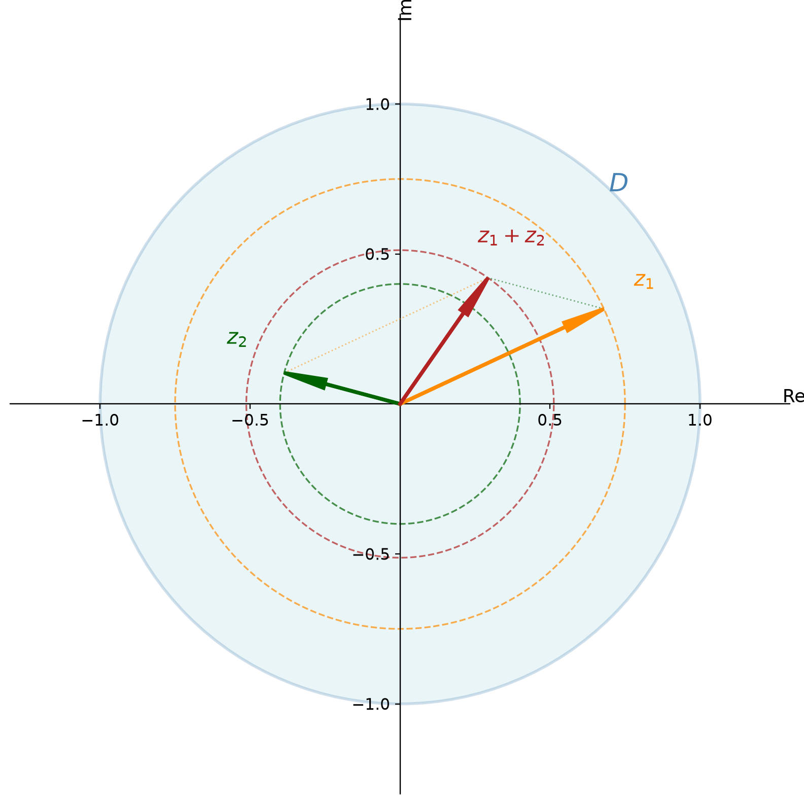

# 1 + 1 = 0：当概率活在单位圆上

你学了一辈子概率，知道两个互斥事件同时发生的概率就是 $p_1 + p_2$。

$0.3 + 0.4 = 0.7$。天经地义。

但量子力学说：不一定。有时候 $0.3 + 0.4 = 0$。有时候 $0.3 + 0.4 = 1$。有时候加出来甚至是一个你从来没见过的数。

因为量子力学的概率，不在你熟悉的那条 $[0,1]$ 线段上。

**它在复平面的单位圆盘里。**

---

## 概率不是线段，是单位圆盘

在单位圆盘 $D = \{z \in \mathbb C \mid |z| \leq 1\}$ 内部的任意复数 $z$，其模平方 $|z|^2 = z\bar z$ 的取值范围是 $I = [0,1]$。这个实数中的闭区间，正是概率的取值范围。这样，任何概率 $p$ 都存在 $p = |z|^2$ 的表示。并且，它是旋转不变的。

换句话说，一个实数概率 $p \in I$，和复平面单位圆盘 $D$ 中的一个半径为 $\sqrt{p}$ 的圆一一对应。若两个复数相差一个旋转，则 $|z_1| = |z_2|$，构成等价关系 $z_1 \sim z_2$——不妨称为**共圆关系**或**等半径关系**。于是概率的单位闭区间可以描述为商集：

$$
I = [0,1] = D/{\sim}
$$

实数概率是复数概率的影子。你扔掉了相位，只剩下长度。经典概率论在这条影子上工作了三百多年，从 Pascal 到 Kolmogorov，没有人怀疑影子下面还有一个完整的圆盘。

直接在实数上相加是经典概率论讨论的问题——整本概率论甚至实分析的课本，你看不到复数的影子。而放到复平面上，对应了半径为 $\sqrt{p_1}$ 和 $\sqrt{p_2}$ 的两个圆的某种加法，这似乎比实数概率的直接相加还缺少直观意义。如果考虑两个圆上的点的复数加法，则有趣得多。

---

## 复数化的概率：$1+1=0$ 是怎么来的

双缝实验是最经典的例子。一束电子射向两条平行狭缝。按照经典概率，电子穿过左缝落到屏幕上某点的概率是 $p_1$，穿过右缝是 $p_2$，合起来应该是 $p_1 + p_2$。

但实验结果是：屏幕上出现了明暗相间的条纹。某些位置电子从不光顾——概率为零。即使两条缝都敞开，电子反而不到那里去了。

这相当于：**两个非零的概率加在一起，得到了零。** 实数加法做不出这个结果。所以概率不能只是实数。

假设 $p_1 = |z_1|^2$ 和 $p_2 = |z_2|^2$，且 $|z_1| \geq |z_2|$。

在推导之前，我们需要一个关键的视角转换：**把复数看作线性算子，而非平面上的点。**

复数加法导致概率可以互相抵消——要理解这一点，必须先看清复数是什么。

---

## 复数的矩阵表示

我们需要改变对数的认识：

> **数是一种特别的线性算子**

复数 $z = x + y\mathrm{i}$ 可以等价地写成一个 $2 \times 2$ 的实矩阵：

$$
z = x + y\mathrm{i}
= |z| \cdot \mathrm{e}^{\theta \mathrm{i}}
= \begin{bmatrix} x & -y \\ y & x \end{bmatrix}
= \sqrt{x^2 + y^2} \begin{bmatrix} \cos\theta & -\sin\theta \\ \sin\theta & \cos\theta \end{bmatrix}
$$

旋转矩阵 $\begin{bmatrix} \cos\theta & -\sin\theta \\ \sin\theta & \cos\theta \end{bmatrix}$ 构成 $\mathrm{SO}(2)$（Special Orthogonal group，二维特殊正交群）——二维平面上的所有旋转。乘以缩放因子 $|z|$ 后，成为 $\mathrm{U}(1)$（Unitary group of degree 1，一维酉群）——模为 $1$ 的复数全体，即单位圆上的旋转群。矩阵的行列式 $\det = x^2 + y^2 = |z|^2$ 正好是概率。$\det$ 是旋转不变的（旋转矩阵的行列式恒为 $1$），所以复数代表的概率也是旋转不变的。

若把 $\mathbb C$ 视为 $2 \times 2$ 实矩阵空间中的一个二维线性子空间，取基：

$$
I = \begin{bmatrix} 1 & 0 \\ 0 & 1 \end{bmatrix}, \quad
J = \begin{bmatrix} 0 & -1 \\ 1 & 0 \end{bmatrix}
$$

使得 $z = x I + y J$，且有 $J^2 = J \circ J = -I$，相当于 $\mathrm{i}^2 = -1$。$\mathrm{i}^2 = -1$ 不是强行规定——它就是这个矩阵自乘的结果。$I$ 是代数单位元，$J$ 是复结构：一个满足 $J^2 = -I$ 的线性变换，它把实向量空间"升级"为复向量空间——乘以 $\mathrm{i}$ 等价于作用 $J$。两者共同生成复数的全部运算。

为什么这个视角重要？因为一旦把复数看成 $I$ 和 $J$ 的线性组合——也就是矩阵——**复数的加法就变成了矩阵的加法**。而矩阵加法允许各分量独立加减：$x I + y J$ 中的 $x$ 和 $y$ 各自独立相加。这是"概率可以互相抵消"的根本原因。

$$
z_1 + z_2 = (x_1 I + y_1 J) + (x_2 I + y_2 J) = (x_1 + x_2) I + (y_1 + y_2) J
$$

其模平方为：

$$
\begin{aligned}
|z_1 + z_2|^2 &= (x_1 + x_2)^2 + (y_1 + y_2)^2 \\
&= x_1^2 + 2x_1x_2 + x_2^2 + y_1^2 + 2y_1y_2 + y_2^2 \\
&= x_1^2 + y_1^2 + x_2^2 + y_2^2 + 2x_1x_2 + 2y_1y_2 \\
&= |z_1|^2 + |z_2|^2 + 2(x_1x_2 + y_1y_2) \\
&= p_1 + p_2 + 2(x_1x_2 + y_1y_2)
\end{aligned}
$$

对比在商集 $I = D/{\sim}$ 中的实数加法 $p_1 + p_2$，这里在复平面上的运算要灵活得多。在上式里我们看到 $p_1 + p_2$ 出现了，但最终的概率受到 $2(x_1x_2 + y_1y_2)$ 项的修正，它反映了两个复数之间的相位差夹角，使得最终的概率取值范围为：

$$
|z_1|^2 - |z_1|^2 \leq |z_1 + z_2|^2 \leq |z_1|^2 + |z_1|^2
$$

这反映出，尽管两个复数分别通过模平方携带了各自的概率信息，但两者做复数加法时，可能会互相抵消一部分，使得求和后对应的概率介于以上范围。于是我们把实数概率求和发展为某种可以互相抵消一部分概率的求和。

现在让我们回到开头的例子，看看 $0.3 + 0.4$ 到底能等于多少。

把 $p_1 = 0.3$ 和 $p_2 = 0.4$ 对应到复平面上。概率 $0.3$ 意味着我们需要的复数模长为 $\sqrt{0.3}$，概率 $0.4$ 意味着复数模长为 $\sqrt{0.4}$。但模长只定了半径，角度是自由的——正是这个角度决定了一切。

**情况一：同相位。** 取 $z_1 = \sqrt{0.3}$，$z_2 = \sqrt{0.4}$（都在正实轴上，角度差为 $0$）。则：

$$
|z_1 + z_2|^2 = (\sqrt{0.3} + \sqrt{0.4})^2 = 0.3 + 0.4 + 2\sqrt{0.12}
$$

竟然超过了 $1$！这是经典概率不可能出现的数——在 Kolmogorov 公理中，互斥事件的和不能超过 $1$。但在量子力学中，这对应的是两个通道**相长干涉**，概率被放大了。经典概率中互斥事件的和 $\leq 1$，是因为实数相加没有干涉项；复数概率多出来的那个交叉项，正是干涉的数学表达。

**情况二：反相位。** 取 $z_1 = \sqrt{0.3}$，$z_2 = -\sqrt{0.4}$（角度差为 $\pi$，即 $180^\circ$）。则：

$$
|z_1 + z_2|^2 = (\sqrt{0.3} - \sqrt{0.4})^2 = 0.3 + 0.4 - 2\sqrt{0.12}
$$

几乎等于零。两个有显著概率的通道，因为相位完全相反，互相抵消殆尽——这就是双缝实验中暗条纹的来历 [1]。

**情况三：任意相位。** 如果 $z_1 = \sqrt{0.3}$，$z_2 = \sqrt{0.4}\,e^{\theta\mathrm{i}}$，则：

$$
|z_1 + z_2|^2 = 0.7 + 2\sqrt{0.12}\cos\theta
$$

随着 $\theta$ 从 $0$ 到 $2\pi$ 旋转，这个值在 $(\sqrt{0.3}-\sqrt{0.4})^2$ 到 $(\sqrt{0.3}+\sqrt{0.4})^2$ 之间连续变化。同一个 $0.3$ 和 $0.4$，因为相位差的不同，可以加出区间里任意一个数。

经典概率只看到了 $0.7$。复数概率揭示了一个完整的可能性区间。两个等长反平行的向量相加得到零——这就是 $1+1=0$ 的几何学。

---

## 为什么是复数？因为数是线性算子

你可能会问：二维实向量 $\mathbb R^2$ 也有方向和抵消，为什么不用 $\mathbb R^2$？

因为复数比向量多一个关键的代数结构：**线性算子的复合**。

上一节我们看到，复数作为 $I$ 和 $J$ 的线性组合，不仅支持加法，还支持矩阵乘法——而矩阵乘法就是线性算子的复合。两个复数相乘仍然是复数，封闭、可逆、有单位元 $I$。这恰好构成一个交换算子环。在量子力学里，这对应演化算子的复合：把系统先演化一步再演化一步，等价于一步复合演化。

$\mathbb R^2$ 做不到。你可以定义内积、外积，但没有一个封闭的、可逆的向量乘法。这就是为什么物理学家死守 $\mathbb C$ 不放——不是他们喜欢虚数，是 $\mathbb C$ 的代数结构恰好匹配物理系统的复合律。

所以复数概率的真正含义是：**概率不是数，是算子。概率的加法不是数的加法，是算子的加法。** 算子的和可以小于任何一个加数——这在矩阵世界里再正常不过。

---

## 回到影子

复数概率不在 $[0,1]$ 线段上，而在整个单位圆盘里。你看到的实数概率只是它投射到线段上的影子。

经典概率论在这条影子上工作了三百多年。从 Pascal 到 Kolmogorov，没有人怀疑影子下面还有一个完整的圆盘。

而一旦你接受概率活在单位圆上，$1+1=0$ 就不再是悖论——它只是两个等长反平行的向量，恰好消去了彼此。

一切从这个反直觉的事实开始。

---

**参考文献**

1. M. Born, *Zur Quantenmechanik der Stoßvorgänge*, Zeitschrift für Physik 37, 863–867 (1926).
